# GitHub for non-Gitters

Or 'how can I contribute content, updates to content and content design using
this amazing tool [named after](https://www.quora.com/Why-is-Git-called-Git) a
pejorative, while installing no tools on my Barnardo's machine?'

In this session, we'll get you a [GitHub
account](https://github.com/join?source=header-home) if you don't have one
already, and we'll take you through how you can contribute via the GitHub web
site without installing any software on your machine.

## What Git is

Git is, in the words of its author "the stupid content tracker". For content
people, it exists to solve a problem with which we're all familiar:

```
    StandardConsentFormv1FINAL-LATEST-ABSOLUTE-LATEST-NO-REALLY.docx 
```

Git tracks more than just one no-longer-poorly-named file, though. Git tracks
whole folders. One of these folders, as tracked by Git, is called a
_repository_, or _repo_ for short. A repository tracks the whole history of a
folder – all the additions, deletions and changes in it, who made them, and
when. This all happens in a _branch_. A branch is just a line of _commits_ –
changes made to the folder.

The main (and often only) branch in a Git repo is called _master_. The master
branch is important – this is where everyone's changes come together. If
content's in master it's seen as good quality – it's been reviewed and it's
ready to serve the purpose for which it exists.

Here's an example piece of history for the _master_ branch of this very team
handbook. The most recent commit is first in the list:

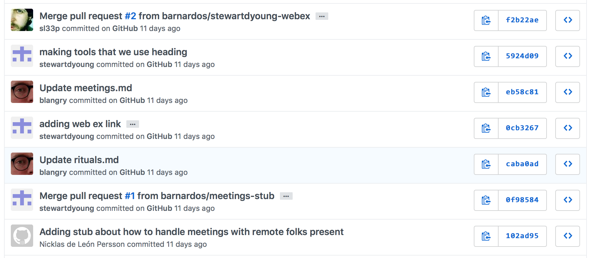

## How does this relate to content?

Good question. For creating linkable content we can all use, the rise of the
[Markdown](https://en.wikipedia.org/wiki/Markdown) language in the last several
years has been notable. This page is itself written in [GitHub-flavoured
Markdown](https://guides.Github.com/features/mastering-markdown/). Markdown lets
you add headings, formatting, lists and links. It also reads well as plain text,
which is critical, as it allows us to look at changes to content in a standard
form.

## So how do I contribute?

Any content that needs a second pair of eyes (2i) will be submitted via a _pull
request_. A pull request is you asking other people to look at the changes
you've made and review them. We'll take a look at the steps you'll take, then
go through them one by one. Here they are:

1. Add, edit, rename or delete a file
2. Add a _commit message_ for the change. Say what you've done in the small 
box, then say *why* you've done it in the larger description box 
3. Repeat step 2. for as many things as you need to
change 
4. Commit your changes to a new branch (never commit to _master_ – even
though GitHub makes it far too easy to do – unless you know why you're doing it)
5. Open a pull request for your branch 
6. Ask for people to comment 
7. Wait for your excellent work to be merged with the _master_ branch.

Let's follow these steps as if we're adding a file.

### 1. Add the named file

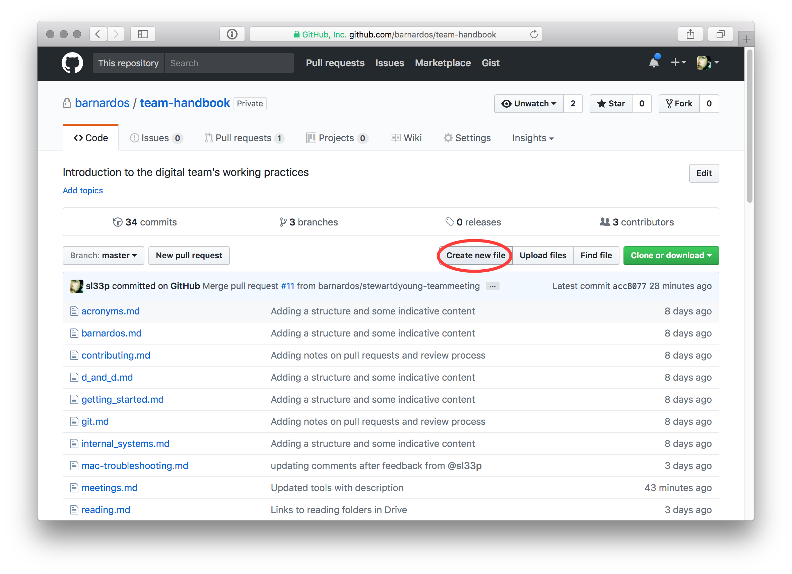

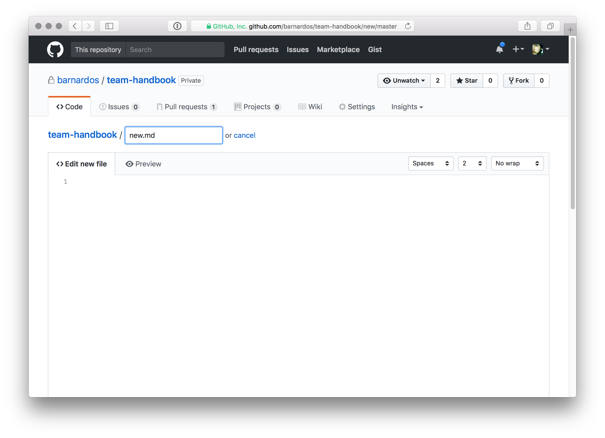

### 2. Write your content

Write your markdown. Here we've linked to some external GitHub help about how
our work flows, and added a couple of (nested) lists.

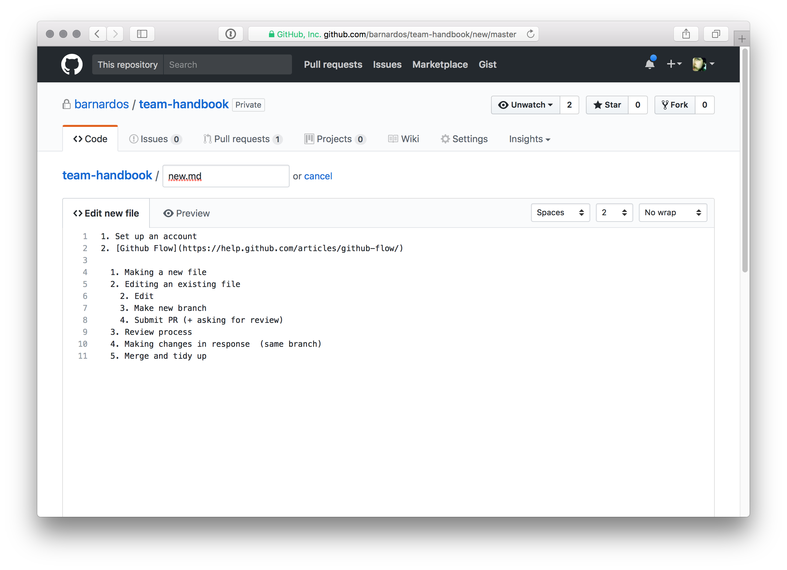

At any point you can preview what you've written. You can check your formatting
and links now.

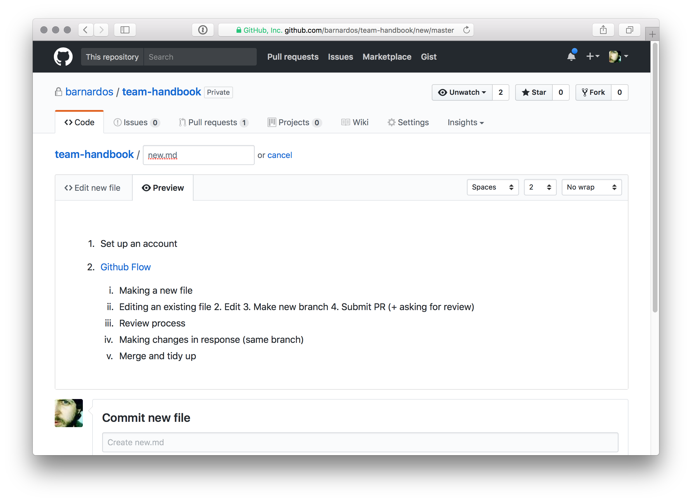

### 3. Committing your changes and making a branch

Through the GitHub interface this happens at the same time. You'll see three
boxes, two for your commit message and an area for creating a branch.

We'll get to the commit message in a minute, but for now:

#### Name your branch!

_The very first thing you should do is to ask for a new branch. Don't commit to
master! Remember master is for finished, reviewed content._

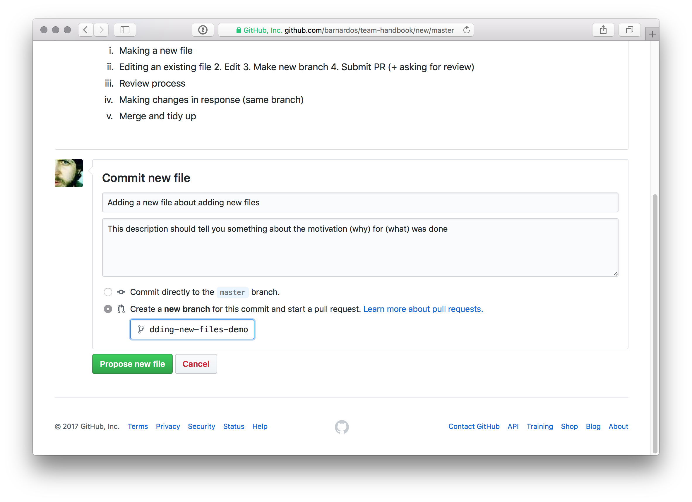

Name this new branch something useful, hyphenated and abbreviated that makes
sense in the context of the repository.

##### Good (in the context of team handbook)

* `add-acronyms` 
* `remove-room-booking-broken-links` 
* `content-style-guide`

##### Bad (in any context)

* `deleted-stuff` 
* `changes` 
* `rgarner-patch-1` (GitHub default!)

#### A good commit message

Your commit message has two parts:

1. a short summary of up to 50 or so characters detailing what it is you've
   changed 
2. a longer description of why you've made the change. It's always easy
   to see what's been changed with Git. It's much harder to figure out why, so take
   this opportunity to be kind to both future you and everyone else who's
   collaborating by thinking about why you're doing what you're doing and
   committing that to a text box.

When you're done, click "Propose new file". Your file will be committed on a new
branch with the name you gave it, and GitHub is showing you a Pull Request page.

More hints on 
[what makes a good commit message](https://github.com/barnardos/devs-manual/blob/master/styleguides/git.md) 
(warning: developer-centric) are available in the 
[devs-manual](https://github.com/barnardos/devs-manual).

### Opening a pull request

Your new file is now committed on your own branch, and you've got a record of
why you made the change. All that remains(!) is to get your changes reviewed.
When they're acceptable, they'll be merged to master.

By this point, GitHub will be showing you the same text from your previous
commit message on this "Open a pull request" page. You'll see this message along
with any changes you've made to files:

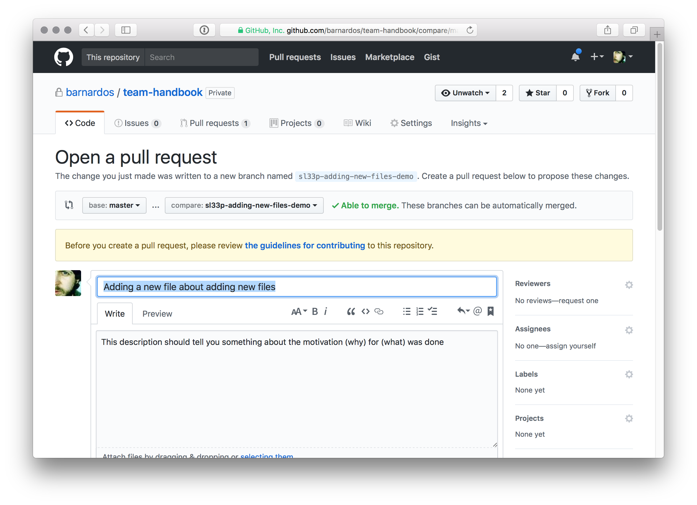

If you've only changed one file it's perfectly acceptable to carry on with this
text. You can make lots of changes on this branch (adding, editing, deleting)
and renaming files, though, and if you do that it's best to have a separate pull
request message that describes all your changes together as a coherent whole.

That's beyond the scope of this initial session.

When you're ready to create the pull request, click the Big Green Button:

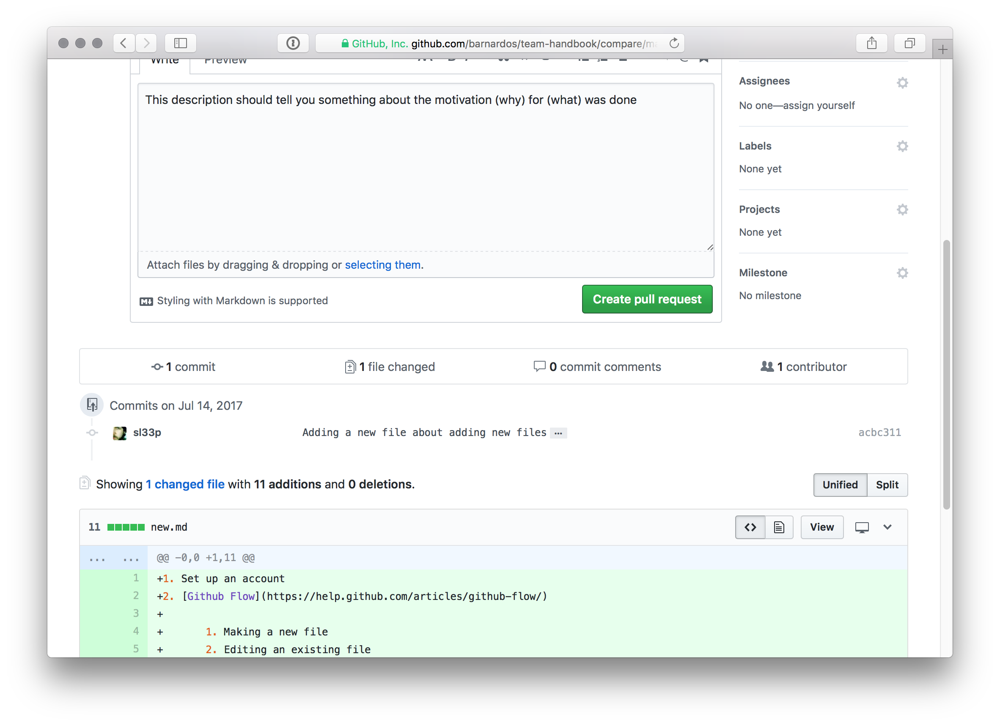

You'll see that your PR is now open. You can (and should) explicitly invite
other people to review your changes. The tiny cog in the circled red area is
your ticket to reviewer participation:

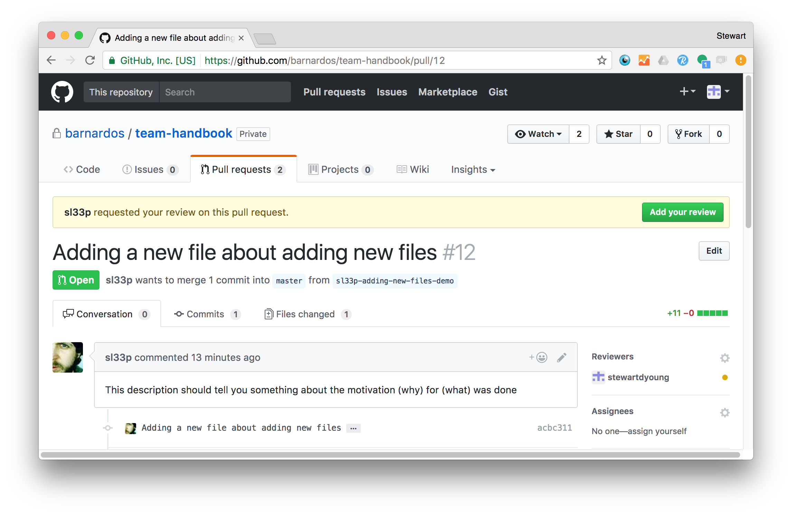

#### Reviewing a PR

GitHub lets you review changes using
[tools](https://help.Github.com/articles/about-pull-request-reviews/) that are
beyond the scope of this session. You can comment on the pull request as a
whole, but reviews come into their own when you comment on individual lines:

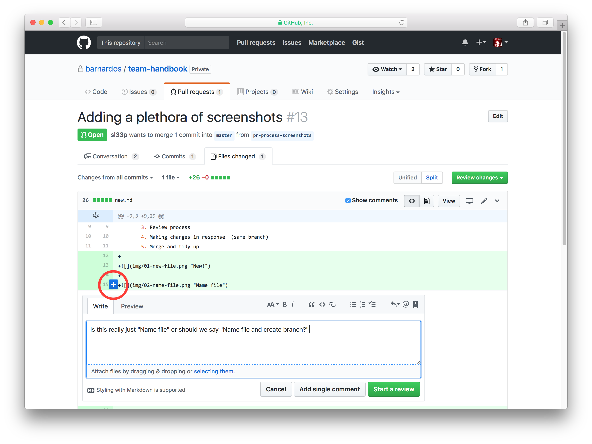

If it's a relatively simple review, the Big Green Button offers the chance to
approve, reject, or simply comment on the whole thing. Bear in mind that a red
cross can ruin someone's day, so in the spirit of being kind and collective
ownership, a comment is often preferable to "Request Changes".

In this example, we've elected to use the common "Looks Good to Me" abbreviation
LGTM in our approval.

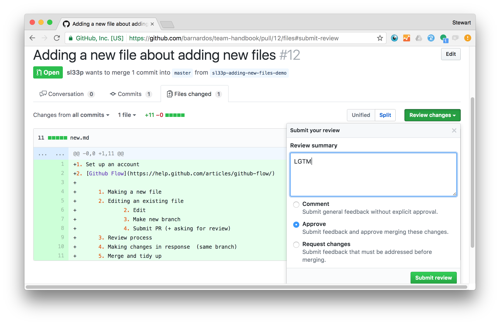

##### If you're happy with the changes

The amount of review required is proportional to the size or impact of the
change. Often you can speed things up by clicking another Big Green Button –
this time "Merge pull request".

Once you've clicked this, the changes are deemed to have passed a second pair of
eyes and are good enough to become part of the hallowed _master_ branch.

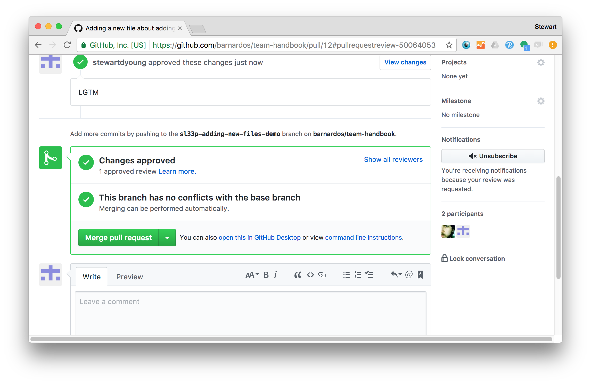

Are you sure?

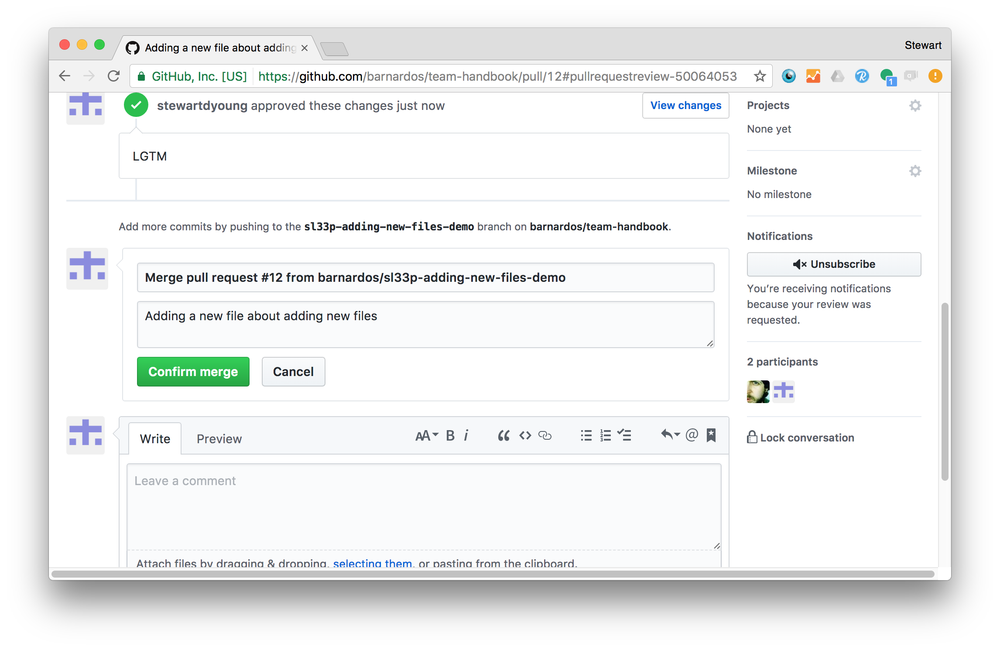

Once you see the purple image, the changes are part of _master_. This doesn't
actually delete your working branch, though. There's no sense leaving it lying
around – click "Delete branch" to get rid of it.


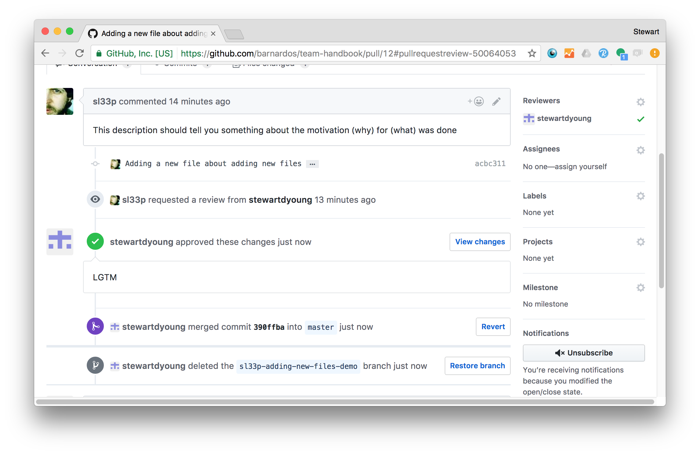

And you're done!

More 
[detailed guidance](https://github.com/barnardos/devs-manual/blob/master/styleguides/pull-requests.md) 
on what makes a good pull request (warning: developer-centric) is available
in the [devs-manual](https://github.com/barnardos/devs-manual).